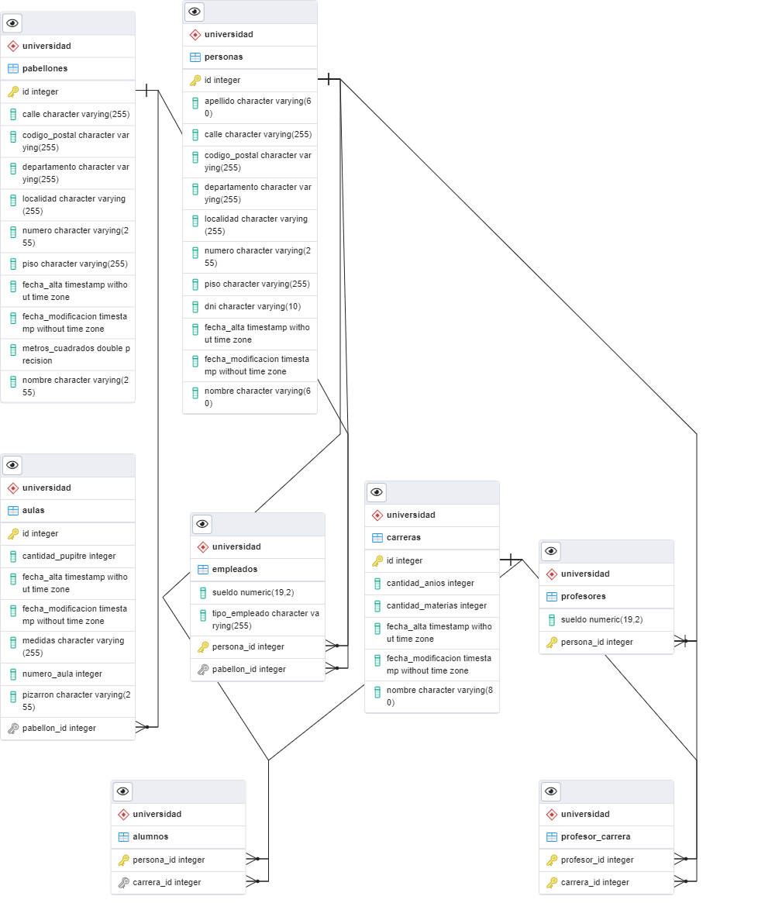

### Caso Practico
- Negocio del caso basado en una universidad.
- Necesidad básica CRUD de todas las entidades.
- Adicional se solicita métodos de consultas particulares.
- La aplicación deberá ser expuesta como servicio Rest.
- La aplicación debe de estar documentada.

**Las entidades que manejara el sistemas son:**

+ Aula
+ Pabellón
+ Carrera
+ Persona:
    * Alumno
    * Profesor
    * Empleado:
		- Administrativo
		- Mantenimiento

------------

**Datos por entidad:**

- Datos básicos de para alumnos, profesores y empleados son: Nombre, Apellido, Dni y Dirección, los datos de este ultimo son: Calle, Numero, Piso, Departamento, Código Postal, Localidad. Tanto los empleados y profesores debe tener un sueldo.

- El aula debe tener: Numero, Tamaño (mts x mts), Cantidad de pupitres, Tipo de pizarrón (Tiza o Pizarra).

- El pabellón deben tener: Tamaño (mts²), Nombre y Dirección con los mismos datos que persona.

- La carrera debe tener: Nombre, Cantidad de Materias y Cantidad de Años estimados.

------------

**Datos extras:**

- Cada entidad contara con un ID propio como también, Fecha de alta y modificación.

- Al dar de alta un Alumno, se le puede asignar una Carrera y para el caso de los Profesores se le puede asignar una o mas Carreras.

- Al dar de alta un Aula, se le puede asignar un Pabellón y este ultimo puede contener varias Aulas.

- Al dar de alta un Empleado, se le puede asignar un Pabellón.

------------

# UniversidadesREST
Paso a paso para ejecutar la aplicación:

1. Instalar PostgreSQL
- Al momento de instalar tener en cuenta la siguiente configuración del motor de base de datos:
- usuario: postgres
- contrasena: admin

(Si ya tiene instalado Postgres omitir este paso y valide el usuario y la contraseña de la base de datos)

2. Luego de instalar el motor de base de datos debe:

- Crear base de datos universidad.

Una vez creada la base de datos ejecutar los siguientes queries:

- create schema universidad;

3. Clonar y descargar el presente proyecto:
- https://github.com/Guadalupe-Moreno/UniversidadesREST.git 

4. Importar el proyecto como MAVEN en la IDE spring tool suite, eclipse o intellij
**se debe tener instalada la librería lombook**

5. Ejecutar el proyecto **run as spring boot app**

------------

**Modelo Relacional:**

****